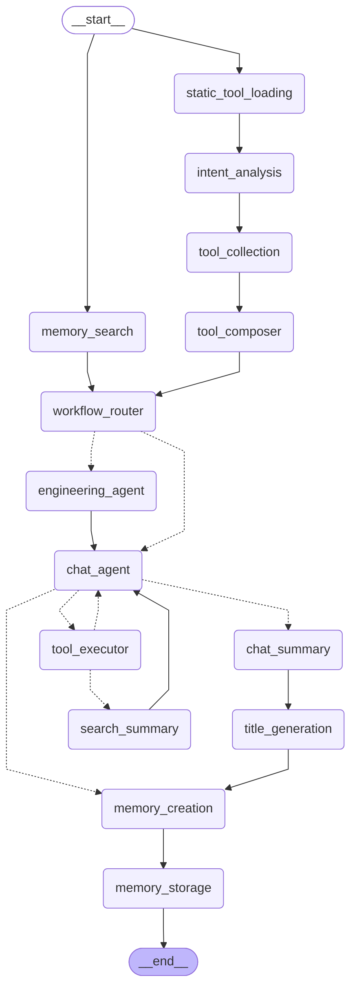

```mermaid
---
config:
  flowchart:
    curve: linear
---
graph TD;
	__start__([<p>__start__</p>]):::first
	intent_analysis(intent_analysis)
	workflow_router(workflow_router)
	engineering_agent(engineering_agent)
	title_generation(title_generation)
	memory_search(memory_search)
	memory_creation(memory_creation)
	memory_storage(memory_storage)
	static_tool_loading(static_tool_loading)
	tool_collection(tool_collection)
	tool_composer(tool_composer)
	tool_executor(tool_executor)
	chat_summary(chat_summary)
	search_summary(search_summary)
	chat_agent(chat_agent)
	__end__([<p>__end__</p>]):::last
	__start__ --> memory_search;
	__start__ --> static_tool_loading;
	chat_agent -.-> chat_summary;
	chat_agent -.-> memory_creation;
	chat_agent -.-> tool_executor;
	chat_summary --> title_generation;
	engineering_agent --> chat_agent;
	intent_analysis --> tool_collection;
	memory_creation --> memory_storage;
	memory_search --> workflow_router;
	search_summary --> chat_agent;
	static_tool_loading --> intent_analysis;
	title_generation --> memory_creation;
	tool_collection --> tool_composer;
	tool_composer --> workflow_router;
	tool_executor -.-> chat_agent;
	tool_executor -.-> search_summary;
	workflow_router -.-> chat_agent;
	workflow_router -.-> engineering_agent;
	memory_storage --> __end__;
	classDef default fill:#f2f0ff,line-height:1.2
	classDef first fill-opacity:0
	classDef last fill:#bfb6fc

```
